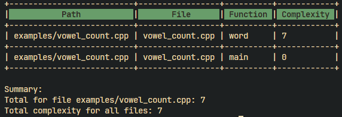

# Catchy
:postbox: Code Complexity Analyzer

## Overview
A tool designed to analyze and measure cognitive complexity across codebases. catchy provides a simple interface to calculate complexity metrics for individual files or entire directories. The tool is built with a focus on simplicity and ease of use, providing a quick and efficient way to identify complex code segments.

## Features
- Static code analysis
- Cognitive complexity metrics calculation
- Tabulated reports with file and function-level details
- Support for single files and directory analysis
- Git integration
- Configurable complexity thresholds

## Installation
Build from source:

- Install Mamba (or Conda) package manager and create a new environment:
    ```bash
    mamba env create -f catchy.yml
    ```

- Activate the environment:
    ```bash
    conda activate catchy
    ```
- Build the project:
    ```bash
    cmake -B build -S . -G Ninja
    cmake --build build
    ```

## Usage
```bash
catchy <input path> [options]

Options:
    --threshold=<N>    Minimum complexity threshold (default: 0)
    --recursive        Recursively analyze directories
    --verbose         Enable verbose output
```

## Example
```bash
# Analyze a single file
catchy path/to/file.cpp

# Analyze a directory recursively
catchy path/to/dir --recursive --threshold=10
```

## Output
Results are displayed in a formatted table showing:
- File path
- File name
- Function name
- Complexity score

A summary of total complexity per file and overall complexity is provided.



## Github Action

Catchy can be integrated into your CI/CD pipeline using Github Actions. The following example demonstrates how to use catchy to analyze code complexity in a pull request:

```yaml
name: Code Complexity Check
on: [pull_request]
jobs:
  complexity:
    runs-on: ubuntu-latest
    steps:
      - uses: miguelcsx/catchy@v1.0.0
        with:
          threshold: '15'
```

## Acknowledgments
This project builds upon:
- The cognitive complexity metric defined in ["Cognitive Complexity - A new way of measuring understandability"](https://www.sonarsource.com/resources/cognitive-complexity/) by G. Ann Campbell at SonarSource
- [complexipy](https://github.com/rohaquinlop/complexipy): A Python tool for calculating cognitive complexity

## Contributing
Contributions are welcome! Fork the project and submit a pull request.

## License
For more information, please refer to the [LICENSE](LICENSE) file.
